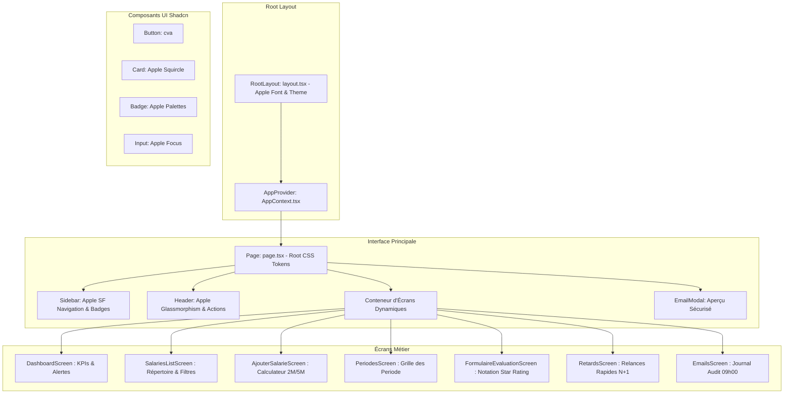

# 📋 Documentation Technique & Journal des Interventions
## Projet : **Premium Essai Manager (Groupe Premium)**

---

## 📌 Sommaire
1. [Vue d'ensemble du Projet](#1-vue-densemble-du-projet)
2. [Architecture Technique & Stack](#2-architecture-technique--stack)
3. [Historique & Résolution Détaillée des Interventions](#3-historique--résolution-détaillée-des-interventions)
   - [Étape 1 : Correction du Build Error (Import AppContext)](#étape-1--correction-du-build-error-import-appcontext)
   - [Étape 2 : Résolution du Runtime Error (useApp & Provider)](#étape-2--résolution-du-runtime-error-useapp--provider)
   - [Étape 3 : Transition & Refactorisation vers le Thème Blanc](#étape-3--transition--refactorisation-vers-le-thème-blanc)
   - [Étape 4 : Intégration Shadcn UI, Tokens CSS :root & Design System Apple](#étape-4--intégration-shadcn-ui-tokens-css-root--design-system-apple)
   - [Étape 5 : Optimisation de la Hiérarchie Visuelle du Dashboard](#étape-5--optimisation-de-la-hiérarchie-visuelle-du-dashboard)
4. [Cartographie des Composants & Architecture des Données](#4-cartographie-des-composants--architecture-des-données)
5. [Fonctionnalités Métier Opérationnelles](#5-fonctionnalités-métier-opérationnelles)
6. [Guide de Démarrage Rapide](#6-guide-de-démarrage-rapide)

---

## 1. Vue d'ensemble du Projet

**Premium Essai Manager** est une solution applicative développée pour la Direction des Ressources Humaines de **Groupe Premium**. Elle digitalise, fiabilise et automatise l'intégralité du cycle de suivi des **périodes d'essai** des collaborateurs :
- Calcul automatique des échéances réglementaires et contractuelles : **Periode 2 Mois** (bilan d'intégration précoce) et **Periode 5 Mois** (décision stratégique de confirmation, renouvellement ou rupture).
- Moteur d'automatisation simulant un batch quotidien à **09:00:00**.
- Détection proactive des retards de validation supérieurs à 2 jours ouvrés avec système de relance en un clic.
- Simulation multi-rôles : **DRH / Admin**, **Responsable N+1** et **Salarié**.

---

## 2. Architecture Technique & Stack

| Pôle | Technologies | Description |
| :--- | :--- | :--- |
| **Frontend Framework** | **Next.js 16 (App Router)** | Rendu hybride et routage moderne avec Turbopack. |
| **Langage & Typage** | **TypeScript 5** | Typage strict de l'état applicatif et des modèles RH. |
| **Gestion d'État** | **React Context API (`useApp`)** | État global centralisé gérant les salariés, périodes, emails et alertes. |
| **Composants d'Interface** | **Shadcn UI (`Button`, `Card`, `Badge`, `Input`)** | Composants accessibles, personnalisables et modulaires basés sur `cva` et `clsx`. |
| **Styling & Design System** | **Tailwind CSS v4 + Variables `:root`** | Tokens sémantiques universels (adieu aux couleurs arbitraires en dur). |
| **Typographie & Esthétique** | **Apple SF Pro Font Stack** | Typographie San Francisco, lissage sous-pixel et rendu haute précision. |
| **Iconographie** | **Apple SF Symbols Look (Lucide React)** | Trait fin équilibré (`strokeWidth={1.75}`), conteneurs squircle adoucis. |
| **Backend (Prévu)** | **Spring Boot 3 + PostgreSQL** | Architecture REST pour la persistance des données. |

---

## 3. Historique & Résolution Détaillée des Interventions

### Étape 1 : Correction du Build Error (Import AppContext)

#### 🔴 Diagnostic & Problème rencontré
Lors de la compilation avec Turbopack sur Next.js, l'erreur de build suivante bloquait le projet :
```text
./src/app/page.tsx:4:1
Error: Export AppContext doesn't exist in target module
Did you mean to import AppProvider?
```

#### 🔍 Analyse de la cause racine
Dans le fichier `frontend/src/context/AppContext.tsx`, l'instance de contexte était déclarée sous la forme :
```typescript
const AppContext = createContext<AppContextType | undefined>(undefined);
```
Le symbole `AppContext` n'était pas exporté directement. Le module exposait uniquement le composant racine `AppProvider` et le custom hook encapsulé `useApp()`. Cependant, dans `frontend/src/app/page.tsx`, l'import tentait d'accéder au contexte brut via :
```typescript
import { useContext } from 'react';
import { AppContext } from '@/context/AppContext';
// ...
const { currentScreen } = useContext(AppContext);
```

#### 🟢 Solution appliquée
- Remplacement du named import `AppContext` par le hook officiel `useApp`.
- Remplacement de l'appel `useContext(AppContext)` par `useApp()`.
- **Fichier modifié** : `frontend/src/app/page.tsx`.

---

### Étape 2 : Résolution du Runtime Error (useApp & Provider)

#### 🔴 Diagnostic & Problème rencontré
Dès la résolution du build, une erreur d'exécution au chargement de la page apparaissait :
```text
Error: useApp must be used within an AppProvider
    at useApp (src/context/AppContext.tsx:565:11)
    at Page (src/app/page.tsx:16:35)
```

#### 🔍 Analyse de la cause racine
Le hook `useApp()` implémente une garde de sécurité :
```typescript
export function useApp() {
  const context = useContext(AppContext);
  if (!context) {
    throw new Error('useApp must be used within an AppProvider');
  }
  return context;
}
```
Dans `frontend/src/app/layout.tsx`, l'arbre de composants rendait `{children}` directement dans le `<body>` sans l'encapsuler dans le fournisseur de contexte `<AppProvider>`. Les composants clients enfants ne recevaient donc aucun contexte initialisé.

#### 🟢 Solution appliquée
- Import de `AppProvider` au sein de `frontend/src/app/layout.tsx`.
- Enveloppement du nœud `{children}` par `<AppProvider>` :
```tsx
export default function RootLayout({ children }: { children: React.ReactNode }) {
  return (
    <html lang="fr" className="h-full antialiased font-sans">
      <body className="min-h-full flex flex-col bg-background text-foreground">
        <AppProvider>{children}</AppProvider>
      </body>
    </html>
  );
}
```
- **Résultat** : Accès transparent et sécurisé à l'état global depuis toutes les pages et tous les composants clients.

---

### Étape 3 : Transition & Refactorisation vers le Thème Blanc

#### 🔴 Demande & Objectif
À la demande de l'utilisateur, l'ensemble de l'interface qui était initialement configurée sur un thème sombre (noir/zinc sombre `bg-black`, `bg-zinc-950`) a été intégralement migré vers une charte graphique **claire, lumineuse et moderne**, tout en conservant l'identité visuelle de **Groupe Premium** (accents rouge corporate).

#### 🛠️ Modifications opérées
1. **Neutralisation du Dark Mode (`frontend/src/app/globals.css`) :**
   - Suppression des requêtes médias `prefers-color-scheme: dark` qui forçaient un fond `#0a0a0a`.
   - Fixation des variables CSS racines sur fond blanc pur (`--background: #ffffff`) et texte sombre contrasté (`--foreground: #171717`).
2. **Structure Principale (`frontend/src/app/page.tsx`) :**
   - Remplacement de `bg-black text-white` et `bg-[#0A0A0A]` par `bg-background text-foreground`.
3. **Barre Latérale de Navigation (`frontend/src/components/Sidebar.tsx`) :**
   - Remplacement du fond sombre `bg-zinc-950` par `bg-card text-card-foreground` avec bordures délimitées `border-border`.
4. **En-tête Applicatif (`frontend/src/components/Header.tsx`) :**
   - Modernisation du bouton déclencheur de simulation batch `Simuler Batch 09:00` en thème clair.

---

### Étape 4 : Intégration Shadcn UI, Tokens CSS :root & Design System Apple

#### 🔴 Demande & Objectifs
1. **Intégration Shadcn UI :** Utiliser les composants et utilitaires Shadcn standard (`Button`, `Card`, `Badge`, `Input`, utilitaire `cn`).
2. **Tokens CSS `:root` :** Remplacer toutes les couleurs codées en dur (ex: `bg-zinc-900`, `bg-[#0A0A0A]`, etc.) par des variables CSS `:root` Tailwind sémantiques (`bg-background`, `text-foreground`, `bg-card`, `text-card-foreground`, `border-border`, `bg-secondary`, `text-muted-foreground`, `bg-primary`, etc.).
3. **Design & Icônes Apple SF :** Adopter l'esthétique épurée des SF Symbols d'Apple (épaisseur `strokeWidth={1.75}`, formes squircles arrondies `rounded-xl`, ombres subtiles `shadow-2xs`, effets de verre `backdrop-blur-md`).
4. **Typographie Apple :** Activer la pile de polices officielle Apple San Francisco (`SF Pro Text`, `SF Pro Display`, `-apple-system`) avec lissage sous-pixel et interlettrage précis.

#### 🛠️ Actions réalisées
1. **Configuration des Dépendances & Utilitaire Shadcn :**
   - Installation de `clsx`, `tailwind-merge` et `class-variance-authority`.
   - Création de `frontend/src/lib/utils.ts` avec la fonction utilitaire standard `cn()`.
2. **Bibliothèque de Composants Shadcn (`frontend/src/components/ui/`) :**
   - `button.tsx` : Bouton dynamique supportant les variantes `default`, `outline`, `secondary`, `destructive`, `ghost`, `apple`.
   - `card.tsx` : Cartes épurées avec sous-composants `CardHeader`, `CardTitle`, `CardDescription`, `CardContent`, `CardFooter`.
   - `badge.tsx` : Badges pill avec palettes système Apple (`appleBlue`, `appleGreen`, `appleOrange`, `appleRed`, `applePurple`).
   - `input.tsx` : Champs de saisie stylisés Apple avec focus ring précis.
3. **Système de Tokens CSS `:root` (`frontend/src/app/globals.css`) :**
   - Centralisation des variables CSS `:root` et mapping automatique via le bloc `@theme` de Tailwind v4.
   - Intégration de la police Apple `-apple-system, BlinkMacSystemFont, "SF Pro Text", "SF Pro Display"`.
   - Ajout des règles de rendu typographique `-webkit-font-smoothing: antialiased` et `-moz-osx-font-smoothing: grayscale`.
4. **Refactorisation Globale de Tous les Écrans et Composants :**
   - `layout.tsx` & `page.tsx` : Alignés sur la typographie Apple et les tokens de fond/texte. Montage du composant `EmailModal`.
   - `Sidebar.tsx` : Boutons de navigation avec icônes SF arrondies, badges Shadcn et profil utilisateur Apple.
   - `Header.tsx` : En-tête en verre translucide (`apple-glass`), boutons d'action Shadcn et sélecteur de rôle interactif.
   - `EmailModal.tsx` : Modale d'aperçu d'email avec fond translucide Apple et badges d'audit.
   - `DashboardScreen.tsx`, `SalariesListScreen.tsx`, `RetardsScreen.tsx`, `AjouterSalarieScreen.tsx`, `DetailSalarieScreen.tsx`, `EmailsScreen.tsx`, `PeriodesScreen.tsx`, `FormulaireEvaluationScreen.tsx` : Tous intégralement migrés vers les tokens `:root` et les composants Shadcn.

---

### Étape 5 : Optimisation de la Hiérarchie Visuelle du Dashboard

#### 🔴 Diagnostic & Constat
Le tableau de bord, bien que moderne et cohérent, présentait une surcharge cognitive :
- Accumulation simultanée de 4 widgets volumineux sur un même écran (prochains Periode, répartition par direction, journal des emails, règles d'automatisation textuelles).
- Micro-textes redondants dans les cartes de KPI ("Consulter ->", "bilans à suivre", "Point d'intégration précoce").
- Grand bandeau d'en-tête répétant de longues explications statiques sur les règles d'automatisation.

#### 🛠️ Solutions appliquées & Principes Apple Human Interface
1. **Dégagement de l'En-tête (Header)** : Remplacement de l'immense bloc texturé par un en-tête aéré, clair et direct (titre axé sur le persona actif, date/statut discrets, boutons d'action essentiels).
2. **Clarification des Cartes KPI** : Élimination des micro-labels superflus pour laisser respirer les chiffres clés et leurs badges d'état.
3. **Bandeau d'Alerte Compact & Ciblé** : S'affiche uniquement en cas de retards actifs (> 48h), avec une action directe unique de relance groupée.
4. **Segmented Control Apple (Séparation Données Essentielles vs Secondaires)** :
   - **"À traiter en priorité"** : Focalise immédiatement l'attention du DRH/Manager sur les dossiers en retard ou en attente.
   - **"Tous les Periode"** : Permet de consulter l'ensemble du pipeline sans encombrer la vue par défaut.
   - **"Derniers emails (09:00)"** : Accessible au clic sans occuper la moitié droite de l'écran.
5. **Intégration Directe du Tableau des Emails** : Le tableau des emails automatiques du Batch 09:00 est réintégré directement sur le dashboard sous les Periode, permettant de consulter les envois et de prévisualiser les messages sans navigation superflue.
6. **Ancrage Fixe de la Sidebar (Sidebar Fixe)** : Isolation du conteneur parent (`h-screen overflow-hidden`) et fixation de la barre latérale (`h-screen sticky top-0`), assurant que seule la zone de contenu défile indépendamment sans entraîner la barre de navigation.

---

## 4. Cartographie des Composants & Architecture des Données



---

## 5. Fonctionnalités Métier Opérationnelles

- **Gestion des Periode & Calendrier Automatique :**
  Dès l'ajout d'un salarié, le système calcule automatiquement la date du Periode à 2 mois et celle à 5 mois, et pré-programme l'envoi des formulaires.
- **Moteur Batch 09:00 :**
  Un bouton interactif permet de simuler le déclenchement de la tâche planifiée quotidienne de 09h00, scannant les échéances et générant les relances nécessaires.
- **Gestion des Retards & Relances Immédiates :**
  Identification automatique des évaluations non validées après 48h (statut `EN_RETARD`), avec possibilité d'envoyer un email de relance direct au manager concerné.
- **Aperçu des Emails d'Audit :**
  Modale d'affichage reproduisant fidèlement les emails internes avec en-tête officiel Groupe Premium et bouton d'action sécurisé.

---

## 6. Guide de Démarrage Rapide

### Prérequis
- **Node.js 18+** ou **Bun**
- Gestionnaire de paquets au choix (npm, yarn, pnpm, bun)

### Démarrage du Frontend
```bash
# 1. Se positionner dans le dossier frontend
cd frontend

# 2. Installer les dépendances (si ce n'est pas déjà fait)
npm install # ou bun install

# 3. Lancer le serveur de développement
npm run dev # ou bun run dev
```

L'application est accessible à l'adresse : **`http://localhost:3000`**.
